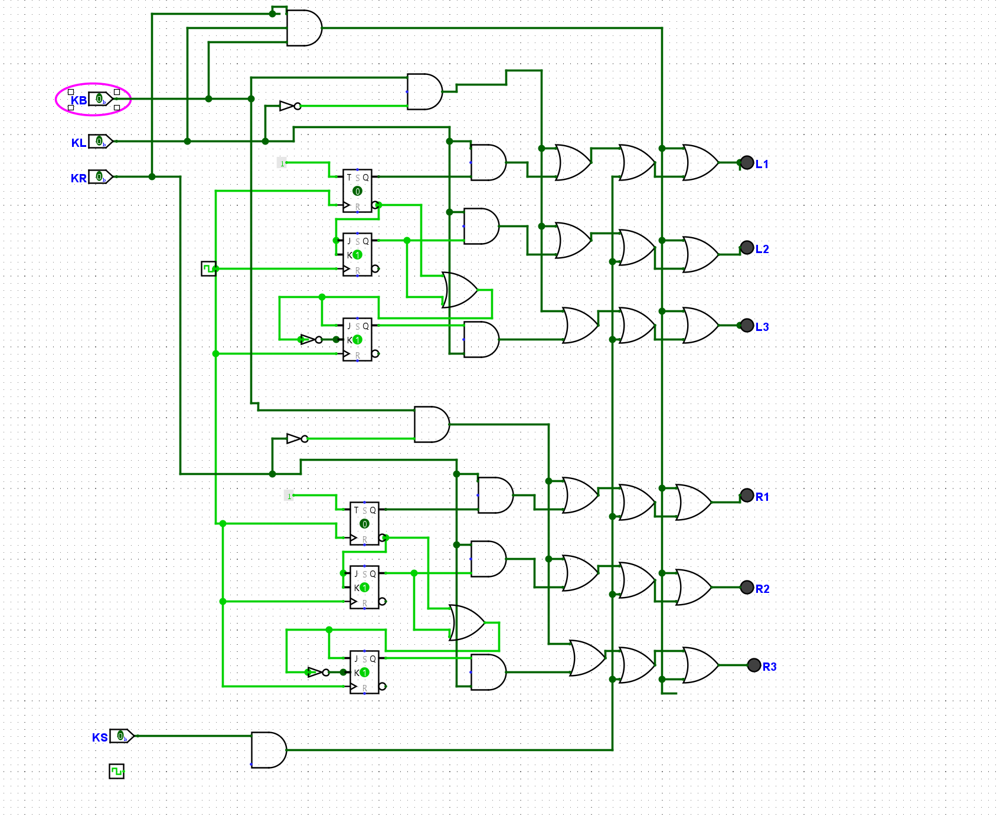
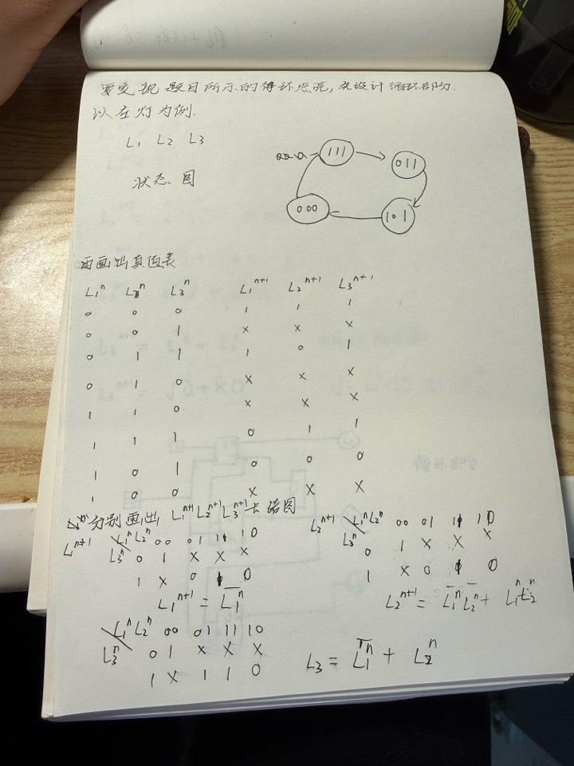
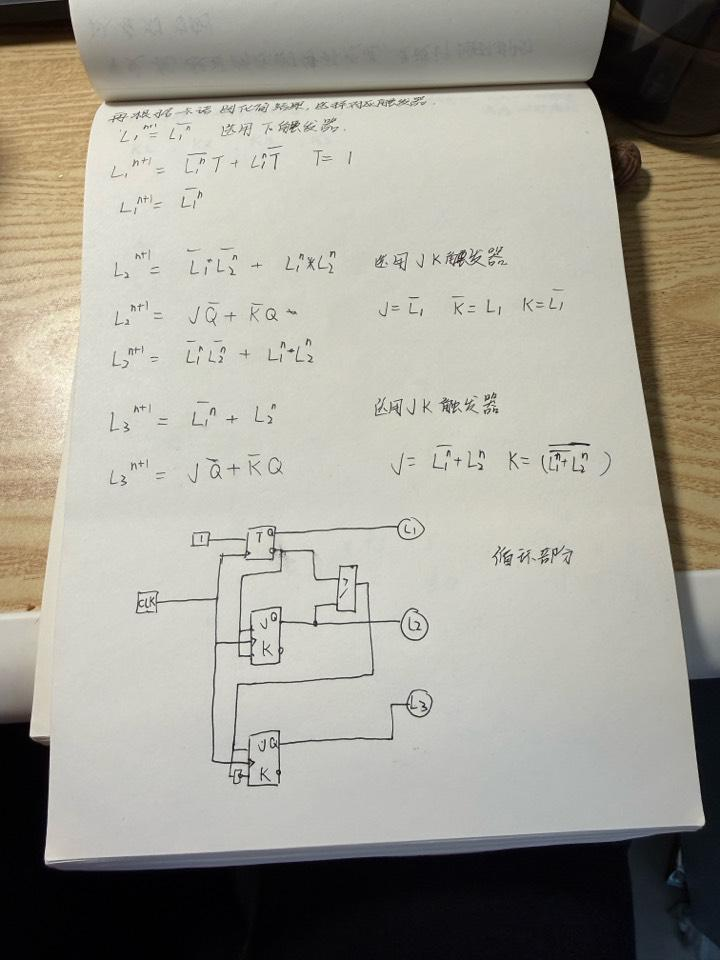

# 吉大数电大作业：汽车尾灯控制电路设计

本项目是一个基于 Logisim-evolution 实现的数字逻辑课程大作业，主题为汽车尾灯控制电路综合设计。

项目核心文件为 [ZUOYE.circ](./ZUOYE.circ)，可直接使用 Logisim-evolution 打开并运行。

## 项目简介

本设计使用 6 个发光二极管模拟汽车尾灯：

- 左侧尾灯：`L1`、`L2`、`L3`
- 右侧尾灯：`R1`、`R2`、`R3`

输入控制信号如下：

- `KL`：左转向控制信号
- `KR`：右转向控制信号
- `KB`：制动信号
- `KS`：停车信号
- `CP`：`1 Hz` 时钟信号
- `F50`：`64 Hz`、占空比为 `50%` 的脉冲信号，用于降低亮度

## 功能要求

### 1. 转向灯控制

当左转或右转时，对应一侧尾灯按顺序依次点亮，形成动态流水效果。

当 `KL` 和 `KR` 同时有效时，两侧尾灯按照相同顺序同步工作。

### 2. 制动灯控制

当车辆制动时：

- 若没有转向信号，或者左右转向同时有效，则 6 个尾灯全部常亮
- 若仅有一侧转向，则转向侧保持顺序点亮，另一侧常亮

### 3. 停车灯控制

当车辆处于停车状态时，全部尾灯点亮，但亮度降低为正常状态的一半。

## 设计说明

本电路设计包含时序逻辑与组合逻辑两部分：

- 时序逻辑部分用于实现尾灯的顺序点亮状态转移
- 组合逻辑部分用于综合转向、制动、停车等控制条件
- 电路中使用触发器及逻辑门实现状态存储与输出控制

从工程图可以看到，左右两侧尾灯控制结构基本对称，便于设计与调试。

## 项目结构

```text
吉大数电大作业/
├─ ZUOYE.circ
├─ README.md
├─ .gitignore
└─ assets/
   └─ images/
      ├─ circuit-overview.png
      ├─ state-derivation-notes.jpg
      └─ jk-design-notes.jpg
```

## 运行方式

1. 安装 Logisim-evolution
2. 使用 Logisim-evolution 打开 `ZUOYE.circ`
3. 在 `main` 电路中观察输入输出与工作效果

## 开发环境

- Logisim-evolution `v3.9.0`

> 工程文件头部标注的版本为 `3.9.0`，建议优先使用相同版本打开，以避免兼容问题。

## 电路截图

### Logisim 总体电路图



### 状态推导与状态图草稿



### JK 触发器设计草稿



## 仓库用途

本仓库用于：

- 保存课程作业源文件
- 展示电路设计结果
- 记录设计思路与推导过程
- 便于后续继续补充实验截图与说明

## 说明

本项目主要用于课程学习、作业提交与个人展示。
